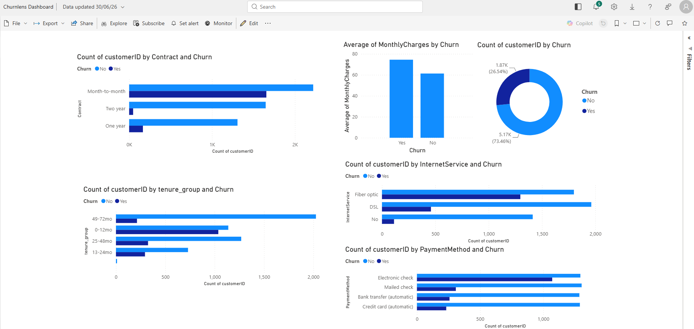

# 🔍 ChurnLens
### *Turning Customer Loss into Business Strategy*
 
> A business intelligence tool that predicts customer churn risk and translates raw data into decisions a non-technical team can actually act on.
 


 
---
 
## 🧩 The Business Problem
 
Every company loses customers. Most don't know *which* customers are about to leave — until it's too late.
 
Customer acquisition costs **5x more** than retention. Yet most analytics tools built for churn prediction require a data science team to interpret them. Business managers end up with a black-box model and no clear next step.
 
**ChurnLens bridges that gap.**
 
It identifies at-risk customers *before* they leave, explains *why* in plain business language, and surfaces those insights through a dashboard any non-technical manager can open on Monday morning.
 
---
 
## 📊 Dashboard Preview
 

 
---
 
## ✨ What It Does
 
| Feature | Description |
|---|---|
| 🧹 **Data Cleaning** | Handles missing values and type inconsistencies automatically |
| 🔍 **Exploratory Analysis** | Identifies key churn drivers across contract type, tenure, pricing, and services |
| 🤖 **Churn Prediction** | Random Forest model flags at-risk customers with 83.8% ROC-AUC |
| 📊 **Power BI Dashboard** | 6 interactive visuals showing churn patterns across every key dimension |
| 💡 **Business Insights** | Plain-English findings any ops or retention team can act on immediately |
 
---
 
## 🔑 Key Findings
 
| Insight | Finding | Business Action |
|---|---|---|
| **Contract type** | Month-to-month customers churn at **42.7%** vs **2.8%** for two-year contracts | Incentivize customers to upgrade to annual/biannual contracts |
| **Tenure** | Customers in their first year churn at **47.7%** | Focus retention efforts in the first 12 months |
| **Pricing** | Churned customers pay **$13 more/month** on average | Review pricing tiers for value perception |
| **Internet service** | Fiber optic customers churn significantly more despite higher spend | Investigate service quality or value perception for fiber users |
| **Payment method** | Electronic check users churn far more than automatic payment users | Encourage customers to switch to automatic payments |
 
> **The headline:** Churn is driven almost entirely by contract structure and pricing — not demographics. Retention strategy should focus on converting month-to-month customers to longer contracts, especially in year one.
 
---
 
## 🧠 Model Performance
 
| Metric | Score |
|---|---|
| ROC-AUC | **0.838** |
| Recall (Churned customers) | **68%** — catches most at-risk customers |
| Precision (Churned customers) | **55%** — acceptable tradeoff given low cost of false alarms |
| Overall Accuracy | **77%** |
 
**Top predictive features:**
1. Contract type (16.6%)
2. Tenure (15%)
3. Total charges (13.4%)
4. Monthly charges (12.6%)
5. Online security subscription (8.4%)
---
 
## 📊 Dashboard Visuals
 
| Visual | Insight |
|---|---|
| 🍩 Churn rate donut | 26.54% overall churn rate across 7,043 customers |
| 📊 Churn by Contract | Month-to-month dominates churn vs one/two-year contracts |
| 📊 Churn by Tenure Group | First-year customers show highest churn risk |
| 📊 Average Monthly Charges | Churned customers pay ~$13 more per month |
| 📊 Churn by Internet Service | Fiber optic users churn at the highest rate |
| 📊 Churn by Payment Method | Electronic check users show significantly higher churn |
 
---
 
## 🗂️ Project Structure
 
```
ChurnLens/
│
├── notebooks/
│   └── churn_analysis.ipynb       # Full EDA, cleaning, and model training
│
├── churn_model.pkl                # Trained Random Forest model
├── label_encoders.pkl             # Encoders for categorical features
├── telco_churn_cleaned.csv        # Cleaned dataset, ready for Power BI
├── dashboard_preview.png          # Power BI dashboard screenshot
│
├── requirements.txt
└── README.md
```
 
---
 
## 📊 Dataset
 
**Source:** [Telco Customer Churn — IBM Sample Dataset](https://www.kaggle.com/datasets/blastchar/telco-customer-churn)
 
- **7,043** customer records
- **21 features** — contract type, tenure, monthly charges, internet service, payment method, and more
- Real-world churn rate of **26.5%** — highly representative of business scenarios
---
 
## 🧠 ML Approach
 
| Step | Detail |
|---|---|
| **Data Cleaning** | Fixed `TotalCharges` type issue (11 blank rows = new customers with 0 tenure, filled with 0) |
| **Encoding** | Label encoded all categorical features for model compatibility |
| **Train/Test Split** | 80/20 split, stratified to preserve churn ratio |
| **Model** | Random Forest Classifier with `class_weight='balanced'` to handle class imbalance |
| **Evaluation** | Precision, Recall, F1-Score, ROC-AUC |
| **Feature Importance** | Identified contract type and tenure as dominant churn predictors |
 
---
 
## 🚀 Getting Started
 
```bash
# Clone the repo
git clone https://github.com/yourusername/ChurnLens.git
cd ChurnLens
 
# Install dependencies
pip install -r requirements.txt
 
# Open the notebook
jupyter notebook notebooks/churn_analysis.ipynb
```
 
To explore the dashboard, open `telco_churn_cleaned.csv` in Power BI Service at [app.powerbi.com](https://app.powerbi.com).
 
---
 
## 🛣️ Roadmap
 
- [x] Dataset sourced and documented
- [x] Data cleaning and preprocessing
- [x] Exploratory data analysis
- [x] Model training and evaluation (ROC-AUC: 0.838)
- [x] Feature importance analysis
- [x] Power BI dashboard (6 visuals)
- [ ] SHAP explainability layer
- [ ] Business report PDF for non-technical stakeholders
- [ ] Deploy model as REST API
---
 
## 🛠️ Tech Stack
 
**Analysis & Modeling:** Python, pandas, scikit-learn, matplotlib
**Dashboard:** Power BI Service
**Dev Environment:** Google Colab
 
---
 
## 💼 Business Impact
 
ChurnLens simulates a real-world BA/Data Analyst deliverable — not just a model, but a complete **decision support system**:
 
- Retention teams get clear, prioritized signals on which customer segments to focus on
- Product teams see which services correlate with long-term loyalty
- Finance teams can model revenue saved through proactive retention campaigns
- All without needing to open a single line of code
---

## 👩‍💻 About the Author

**Anu** — B.Tech Computer Science & Data Science, Presidency University Bengaluru
CSI Chapter President | IEEE Student Coordinator | BEL Process Automation Intern

Passionate about translating data into decisions that non-technical teams can actually use.

[](https://github.com/anupriya-tv)
[](https://www.linkedin.com/in/anupriya-t-v/)

---

*Built with Python · Power BI · scikit-learn · Pandas*
